# ComfyUI Agentic Workflow Nodes

ComfyUI Agentic workflow nodes, or CRAG nodes, are custom ComfyUI nodes for designing and running agentic systems on Runpod. CRAG nodes build a typed deployment graph for agents, browsers, LLMs, databases, storage, commands, and keep-alive policy.

The CRAG node package follows one core rule: all nodes are declarative except `Run on Runpod`. In `plan` mode, `Run on Runpod` produces an ordered deployment plan and never calls Runpod. In apply modes, it uses injectable Runpod, SSH, and SQLite state abstractions so behavior can be tested and mocked.

At the foundation, nodes contribute one of two effects: a managed Runpod resource with environment values for later agent pods, or a queued runtime command to run over SSH after pods launch. This keeps CRAG close to a Terraform provider model: low-level resources such as pods, volumes, env, and SSH commands are composed into higher-level app and agent nodes.

## Workflow Screenshots

<details>
<summary>Agent Skills and MCP Plan</summary>

Graph mode:

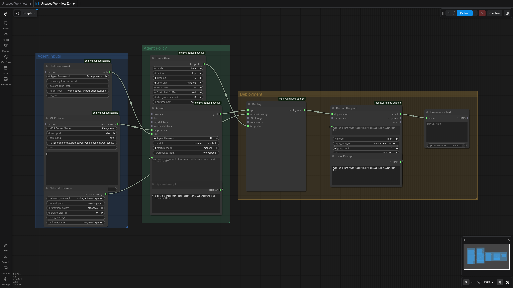

App mode:

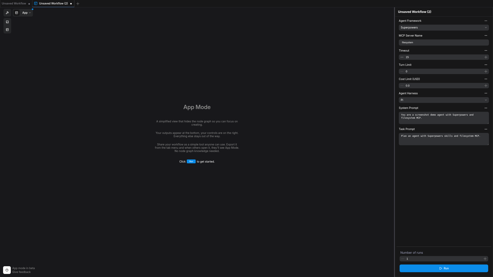

</details>

<details>
<summary>Claude Data Agent Plan</summary>

Graph mode:

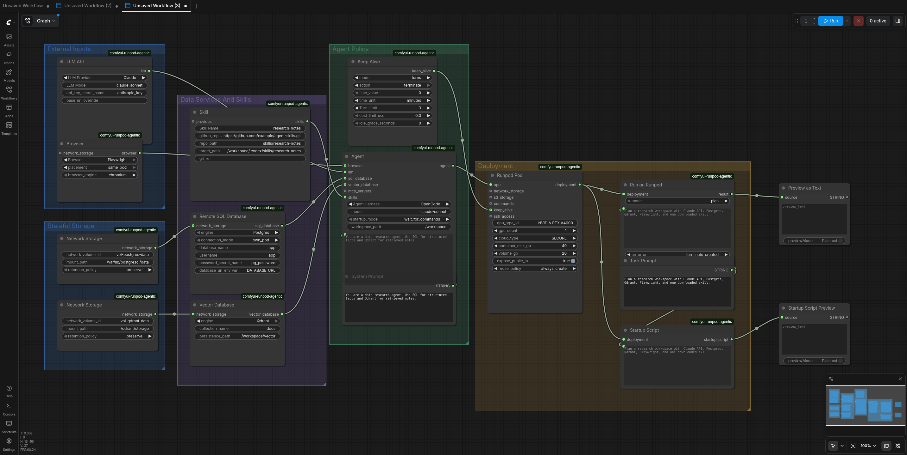

App mode:

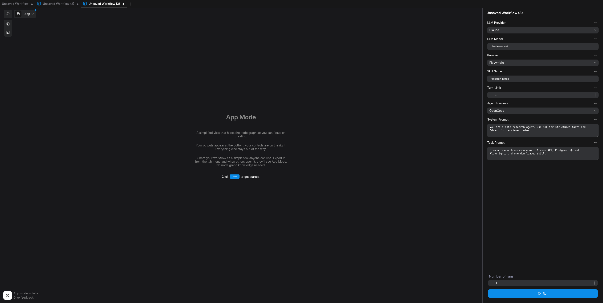

</details>

<details>
<summary>Container Snapshot Plan</summary>

Graph mode:

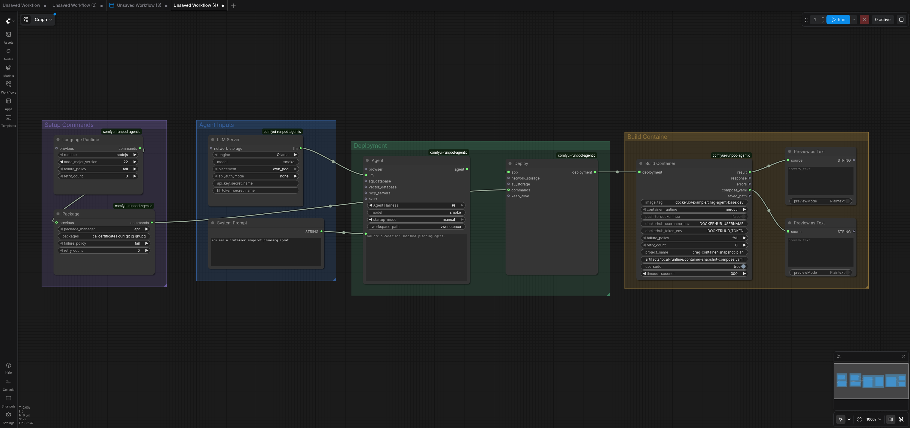

App mode:

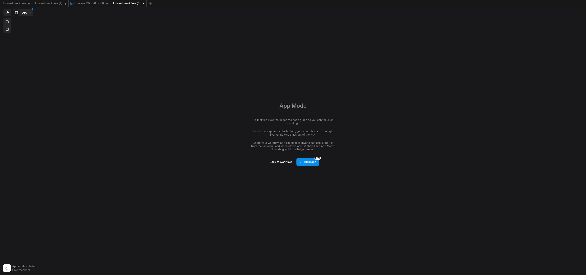

</details>

<details>
<summary>Local Agent Skills and Postgres Setup</summary>

Graph mode:

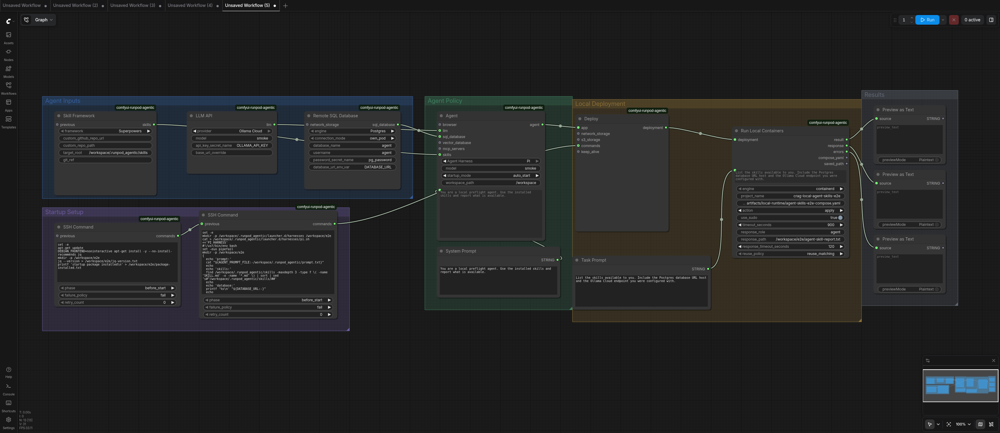

App mode:

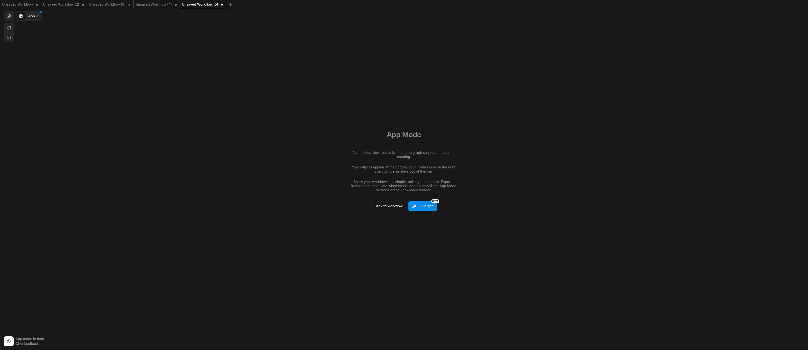

</details>

<details>
<summary>Local Ollama Cloud DeepSeek Setup</summary>

Graph mode:

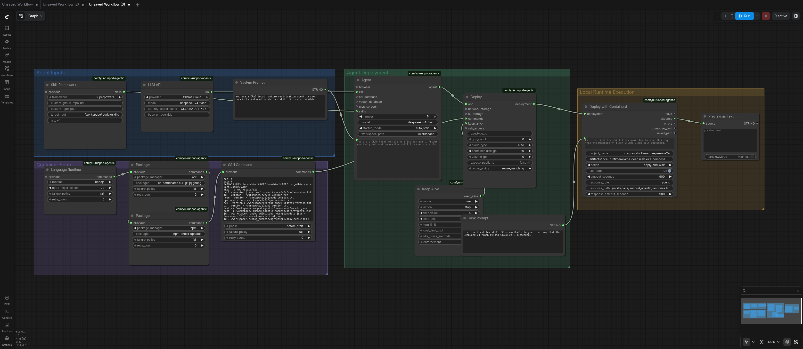

App mode:


</details>

<details>
<summary>Local Runtime Preflight Plan</summary>

Graph mode:

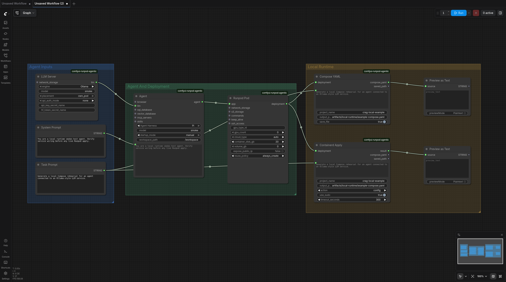

App mode:

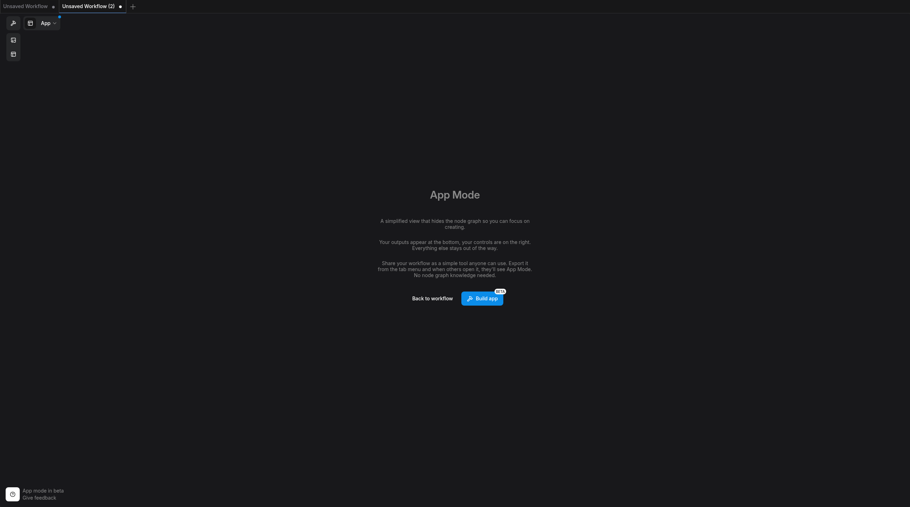

</details>

<details>
<summary>Neko and Ollama Agent Plan</summary>

Graph mode:

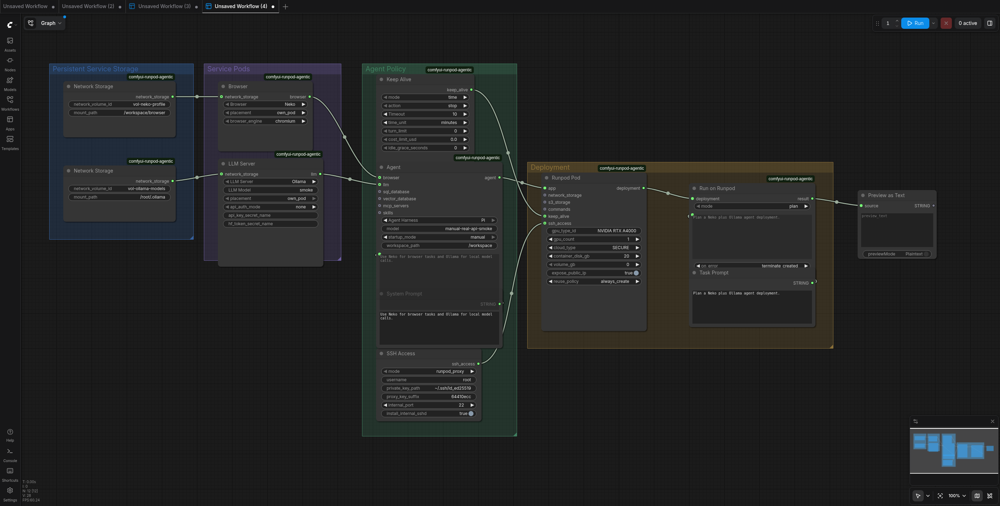

App mode:

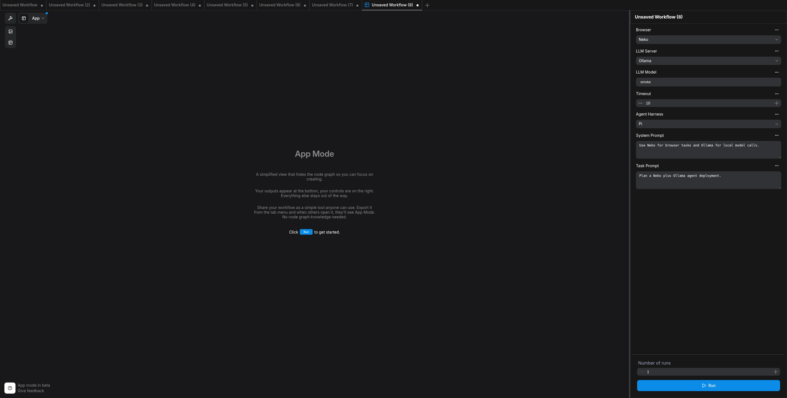

</details>

## Status

The ComfyUI Agentic workflow nodes currently include:

- ComfyUI node classes and registration mappings for agents, services, storage, commands, logs, and MCP servers.
- Dataclass specs for the requested resource model.
- Template resolution with example YAML config.
- Planner for dependency extraction, materialization ordering, runtime contracts, and keep-alive lifecycle timestamps.
- Runpod GraphQL client abstraction.
- SSH command/file abstraction with endpoint extraction tests.
- SQLite state ledger for runs, resources, events, and counters.
- Route handler logic for resources, runs, pod lifecycle, cleanup, and turn counting.
- Offline unit tests using fake Runpod and SSH clients.

## Installation

Clone this repository into ComfyUI's custom nodes directory:

```bash
cd ComfyUI/custom_nodes
git clone <repo-url> comfyui-runpod-agentic
cd comfyui-runpod-agentic
python -m pip install -r requirements.txt
```

For development:

```bash
python -m pip install -e .[dev]
scripts/test
scripts/lint
scripts/build
```

## Configuration

Set the Runpod API key in the ComfyUI server environment. Do not put it in workflow widgets.

```bash
export RUNPOD_API_KEY=...
```

The Runpod token is read only by the server-side API client. It is not exposed as a node input and should not appear in workflow JSON.

Copy and adapt the examples:

```text
defaults/config.example.yaml
defaults/templates.example.yaml
```

The default state DB path is:

```text
ComfyUI/user/runpod-agentic/state.sqlite
```

When running outside ComfyUI, set `COMFYUI_USER_DIR` to control that location.

## Node Overview

For a complete walkthrough of the CRAG node mission, graph model, node inputs, credentials, prompts, storage, execution modes, and workflow recipes, see [docs/user_guide.md](docs/user_guide.md).

Core:

- `Deploy`: creates the portable workload spec around the primary agent.
- `Run on Runpod`: plan/apply/stop/terminate/destroy output node for the Runpod target with the per-run agent prompt and placement settings.
- `Keep Alive`: time, turns, cost, or manual policy with server-side, pod-side, or layered enforcement.
- `Logs`: reads captured local run logs and returns `(logs, saved_path)` text outputs.

Apps and services:

- `Agent`: composition point for browser, LLM, SQL, vector, MCP resources, skills, and the agent system prompt.
- `Browser`: Neko or Playwright.
- `Web Terminal`: opt-in ttyd terminal for the agent container. The frontend extension opens an in-page terminal panel when a run returns a terminal URL.
- `LLM Server`: Ollama or vLLM own-pod service.
- `LLM API`: Codex/OpenAI, Claude/Anthropic, or Ollama Cloud env contract.
- `MCP Server`: chainable stdio/http/sse MCP server definitions exposed to the agent as `MCP_SERVERS_JSON` and `.runpod_agentic/mcp_servers.json`.
- `Skill`: chainable GitHub skill download into the agent workspace.
- `Skill Framework`: chainable preset installer for popular skill frameworks such as Superpowers.
- `Remote SQL Database`: Postgres/MySQL through a provisioned pod or existing `DATABASE_URL` env.
- `Local SQL Database`: SQLite file path plus startup setup for the agent pod.
- `Vector Database`: Chroma or Qdrant.
- `Network Storage` and `S3 Storage`.
- `SSH Command`: declarative command chain executed by `Run on Runpod`.
- `Package`: installs apt, npm, or pip packages. Apt packages always run `apt-get update` first.
- `Language Runtime`: installs Node.js with npm from NodeSource, or Python with pip and venv from apt.
- `Build Container`: commits a configured container to a tagged image and can push it to Docker Hub for reuse.
- `Startup Script`: ready-to-paste bash startup script for a deployment.
- `Compose YAML`: exports a local Docker Compose compatible projection.
- `Run Local Containers`: save or plan the same deployment against a local Docker, Podman, or containerd engine, then optionally apply, reuse, stop, or terminate it.

Harness support:

| Harness | Prompt | Model | System prompt | LLM env | MCP env | Skills | Response files |
| --- | --- | --- | --- | --- | --- | --- | --- |
| Codex | yes | yes | yes | yes | yes | symlinked | yes |
| Claude | yes | yes | yes | yes | yes | symlinked | yes |
| OpenCode | yes | yes | no | yes | yes | symlinked | yes |
| Hermes | yes | yes | no | yes | yes | symlinked | yes |
| Pi | yes | yes | no | yes | yes | symlinked | yes |

## Example Workflows

### Claude API, Postgres, Qdrant, Playwright, Setup Command

```text
LLM API(provider=Claude, model=claude-sonnet, secret=anthropic_key)
MCP Server(name=filesystem, transport=stdio, command=npx, args="-y @modelcontextprotocol/server-filesystem /workspace")
Skill Framework(framework=Superpowers, target_root=/workspace/.runpod_agentic/skills)
Remote SQL Database(engine=Postgres, connection_mode=own_pod, database=app, username=app, secret=pg_password)
Vector Database(engine=Qdrant, collection=docs)
Browser(browser=Playwright, placement=same_pod)
Agent(harness=OpenCode, model=claude-sonnet, system_prompt="Follow repository conventions.", mcp_servers=MCP Server)
SSH Command(phase=before_start, command="pip install -e /workspace/tools")
Network Storage(volume_id=..., mount=/workspace, retention_policy=preserve)
Keep Alive(mode=time, value=30 minutes, action=stop)
Deploy(app=Agent, network_storage=Network Storage, commands=SSH Command, keep_alive=Keep Alive)
Run on Runpod(mode=plan or apply_and_wait, prompt="Implement the requested change.")
```

### Local Web Terminal

```text
Web Terminal(shell=/bin/bash, port=7681, host_port=7681, auth=none)
Agent(harness=Pi, startup_mode=manual, terminal=Web Terminal)
Deploy(app=Agent)
Run Local Containers(action=apply, prompt="Launch an interactive terminal.")
```

The local run result includes `terminal_urls.agent`, and the optional frontend extension opens that URL in an in-page terminal panel. The example pair is `examples/workflows/api_local_web_terminal_up.json` and `examples/workflows/api_local_web_terminal_down.json`.

Plan order:

```text
CREATE_OR_RESUME sql
CREATE_OR_RESUME vector
WAIT_READY sql
WAIT_READY vector
RESOLVE_DEPENDENCY_CONTRACTS
CREATE_OR_RESUME agent
WAIT_SSH agent
RUN_SSH_COMMAND before_start
WRITE_RUNTIME_CONFIG
LAUNCH_AGENT
MONITOR_KEEP_ALIVE
```

### Self-hosted vLLM

```text
LLM Server(engine=vLLM, model=Qwen/Qwen3-0.6B, placement=own_pod)
Agent(harness=Codex, llm=LLM Server)
Deploy(app=Agent)
Run on Runpod(mode=apply)
```

The planner creates the vLLM pod first, then injects OpenAI-compatible endpoint variables into the agent runtime contract.

### SQLite and S3

```text
Local SQL Database(engine=SQLite, database_path=/workspace/db/app.sqlite)
S3 Storage(endpoint=..., bucket=..., access_key_secret=s3_access, secret_key_secret=s3_secret)
Agent(harness=Pi, sql_database=SQLite)
Deploy(app=Agent, s3_storage=S3)
Run on Runpod(mode=apply)
```

SQLite is `file_only`, so no database pod is created. The runner queues a setup command to install `sqlite3` when needed and initialize the file path before the agent launches.

## Testing

```bash
scripts/test
```

The test suite does not require Runpod credentials. API and SSH behavior are covered through injected fakes and focused helper tests.

## ComfyUI E2E Smoke Test

To verify the nodes load inside a real ComfyUI process in CPU-only mode:

```bash
scripts/e2e-comfy-cpu
```

The script creates a temporary ComfyUI base directory, links this repo into `custom_nodes`, runs ComfyUI's quick custom-node load path, starts a CPU-only server, and checks `/object_info` for all CRAG nodes.

Useful options:

```bash
COMFYUI_E2E_DIR=/path/to/ComfyUI scripts/e2e-comfy-cpu --skip-clone
COMFYUI_E2E_INSTALL_DEPS=1 scripts/e2e-comfy-cpu
COMFYUI_E2E_PORT=18200 scripts/e2e-comfy-cpu
```

In restricted sandboxes, the server phase may need permission to bind a localhost port.

To generate screenshots of the UI-format example workflows:

```bash
python -m pip install -e .[dev]
python -m playwright install chromium
scripts/screenshot-ui-workflows --skip-clone
```

By default, the script launches a temporary CPU-only ComfyUI server, loads `examples/workflows/ui_*.json`, fits each graph to the canvas, captures graph mode and app mode, and writes PNG files under `artifacts/workflow-screenshots`.

## Live Runpod Smoke Test

After `RUNPOD_API_KEY` and `RUNPOD_SSH_PROXY_SUFFIX` are present in `.env.d/runpod.env`, run a minimal real pod workflow:

```bash
scripts/run-live-smoke \
  --cloud-type COMMUNITY \
  --gpu-type-id "NVIDIA GeForce RTX 3090"
```

The live smoke creates one agent pod, connects through Runpod proxy SSH, runs a small command, writes runtime config files, and terminates the pod by default. Use `--cleanup stop` or `--cleanup none` only when you intentionally want to inspect the pod afterward.

Clean up any managed pods by prefix:

```bash
scripts/cleanup-runpod-pods --action terminate
```

Validate the live Runpod GraphQL input types used by the CRAG nodes:

```bash
scripts/check-runpod-schema --json
```

Opt-in pytest live checks are also available. The schema check only needs `RUNPOD_API_KEY`; creating a real pod additionally requires `RUNPOD_LIVE_CREATE_POD=1`, `RUNPOD_TEST_TEMPLATE_ID`, and `RUNPOD_TEST_GPU_TYPE_ID`.

```bash
RUNPOD_LIVE_TESTS=1 scripts/test tests/test_runpod_live.py
```

## Creating Runpod Templates

Template creation is scripted and repeatable:

```bash
scripts/create-runpod-templates \
  --spec defaults/runpod_templates.bootstrap.json \
  --map defaults/runpod_template_ids.json
```

The script reads `RUNPOD_API_KEY` from the environment or `.env.d/runpod.env`, calls Runpod's GraphQL `saveTemplate` mutation, and persists template IDs into the JSON map. If a template key already exists in the map, the saved ID is sent back to Runpod so the template is updated instead of creating a new one.

Preview sanitized inputs without calling Runpod:

```bash
scripts/create-runpod-templates --dry-run
```

The runner injects a small runtime layer under `.runpod_agentic` over SSH before starting the agent, so templates do not need to bake in the CRAG launcher. The entrypoint is `.runpod_agentic/launcher.sh`; it loads `.runpod_agentic/launcher.d/*.sh`, runs optional preflight hooks, uses `CRAG_AGENT_LAUNCH_COMMAND` when set, falls back to `runpod-agent-launch` if the image provides it, and then dispatches to harness stubs under `.runpod_agentic/launcher.d/harnesses/` for tools such as Codex, Claude, Hermes, OpenCode, and Pi. Codex, Claude, Hermes, and OpenCode agents queue their recommended CLI install command before launch and verify it with `--help`.

## Security Notes

- `RUNPOD_API_KEY` is read server-side only.
- Secret refs are represented as Runpod secret placeholders in env contracts.
- Route handlers do not accept arbitrary shell commands.
- Runtime env redaction helpers cover names containing `KEY`, `TOKEN`, `SECRET`, or `PASSWORD`.
